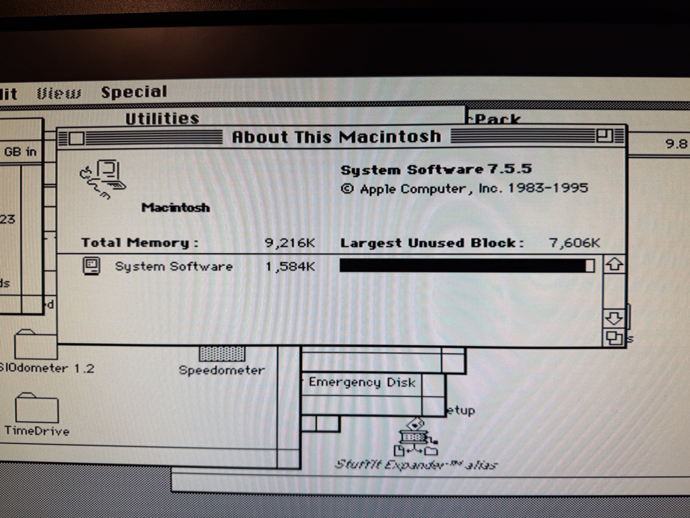
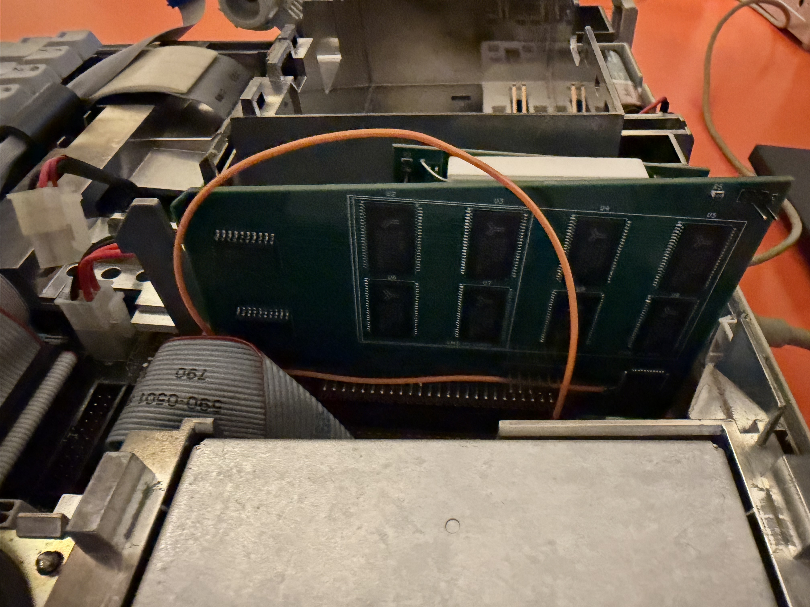
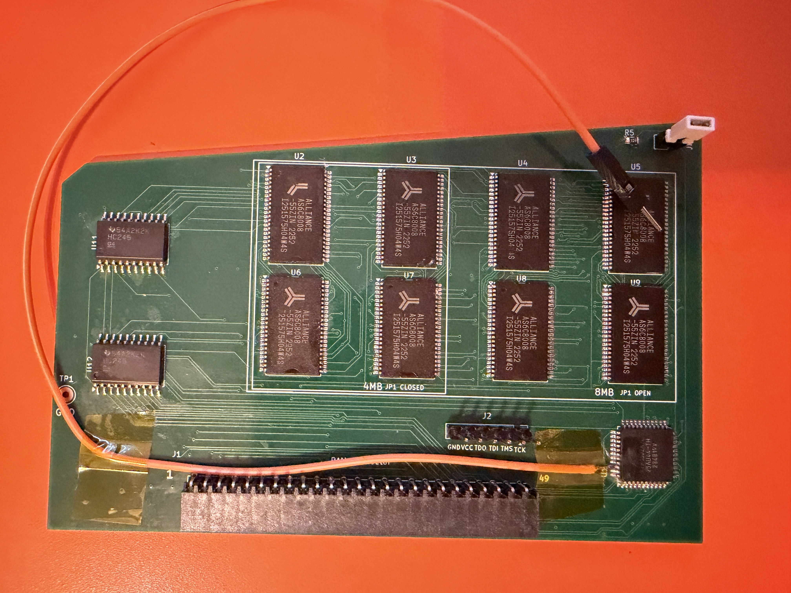
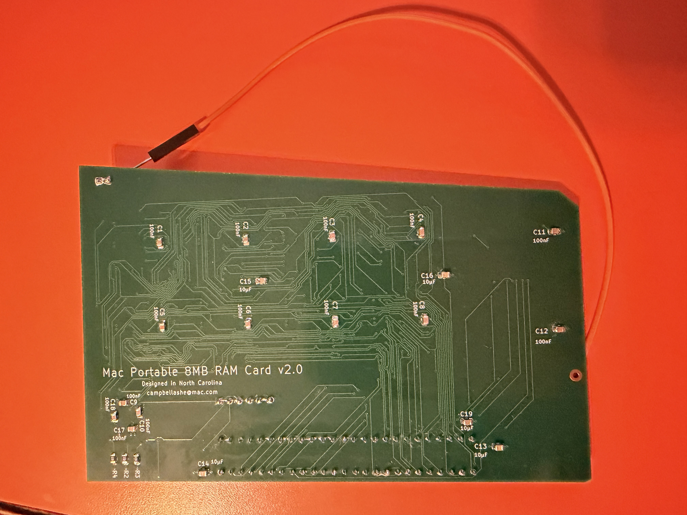
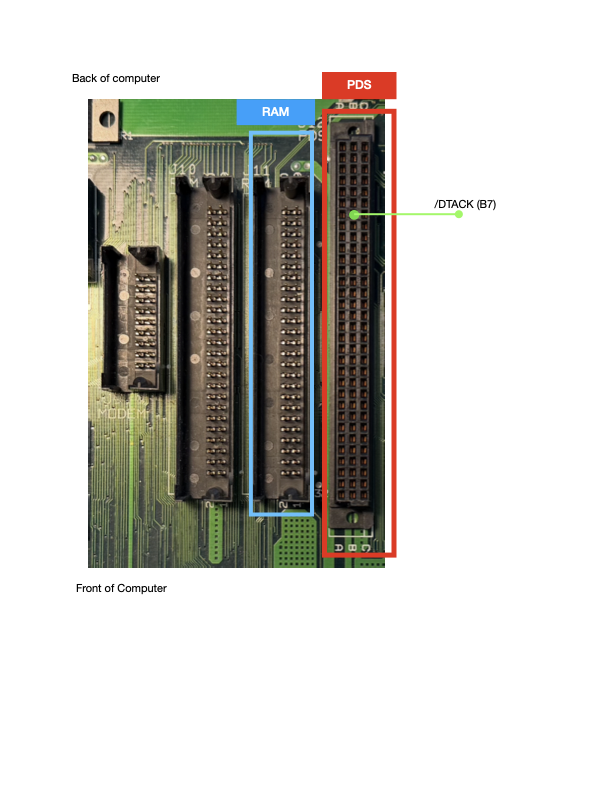

# Mac Portable 8MB RAM Card (v2 — All-5V)

Expands a Macintosh Portable to **9 MB total** (1 MB onboard + 8 MB this card) — the maximum the Portable's address space supports.

All-5V design using 1M×8 SRAM chips. No level shifters, no LDO regulator, no 3.3V rail. Shares the same connector, CPLD, and bus transceiver approach as the [4MB card](https://github.com/2tf2294x4g-maker/MacintoshPortable4MB_RAM) but doubles capacity using larger SRAM.

> ✅ **HARDWARE VALIDATED** — Built and tested on a Mac Portable M5120 (July 2026). Boots reliably, passes 9 MB in About This Macintosh, and with the DTACK bodge (see below) outperforms the 1 MB baseline.

---

## Photos

| | |
|---|---|
|  |  |
| System 7.5.5 — 9,216K total memory | Card seated in Portable with orange DTACK bodge wire |


*Orange bodge wire running from CPLD pin 42 to PDS slot pin B7 (/DTACK)*

| | |
|---|---|
|  |  |
| Component side — all 8 AS6C8008 SRAMs, bus transceivers, CPLD, and DTACK bodge wire | Solder side — bypass caps and bulk caps

---

## Specs

| | |
|---|---|
| Capacity | 8 MB (8× 1M×8 SRAM) |
| System total | 9 MB (1 MB onboard + 8 MB card) |
| Bus width | 8-bit × 2 banks (addressed via CPLD) |
| Logic | ATF1502ASL CPLD (5V, TQFP-44) |
| SRAM | 8× AS6C8008-55ZIN (5V, TSOP-II-44) |
| Layers | 4 (F.Cu signal / GND plane / +5V plane / B.Cu signal + pour) |
| Connector | Samtec BCS-125-F-D-HE (50-pin 2×25, horizontal entry) |
| Size jumper | JP1: OPEN = 8MB (all chips) / CLOSED = 4MB (populate U2 U3 U6 U7 only) |

---

## Bill of Materials

| Ref | Qty | Value | Package | Part / Notes |
|-----|----:|-------|---------|--------------|
| U2–U9 | 8 | AS6C8008-55ZIN | TSOP-II-44 | Alliance Memory — 1M×8 5V SRAM 55 ns |
| U1 | 1 | ATF1502ASL | TQFP-44 | Microchip ATF1502ASL-**25AU44** — must be ASL (5V), not ASV |
| U11, U12 | 2 | 74HC245 | SOIC-20 **wide** | SN74HC245**DW** — verify wide (7.5 mm) body |
| J1 | 1 | RAM connector | Samtec BCS-125-F-D-HE | 50-pin socket, horizontal entry — free Samtec sample |
| J2 | 1 | JTAG header | 1×6 2.54 mm pin header | Pin 1 (square pad) = TCK |
| JP1 | 1 | SIZE jumper | 1×2 2.54 mm pin header + shunt | OPEN=8MB, CLOSED=4MB |
| C1–C12, C17, C18 | 14 | 100 nF | 0805 | X7R 50V ceramic bypass |
| C13–C16, C19 | 5 | 10 µF | 0805 | X5R 16V ceramic bulk |
| R2–R5 | 4 | 10 KΩ | 0805 | 5% thick film |

Full BOM: [PortableRAM-8MB-BOM.csv](PortableRAM-8MB-BOM.csv)

---

## ⚠️ Important — SRAM Pinout Difference

The AS6C8008 (8MB card) and AS7C4096A (4MB card) are **both TSOP-II-44 but have different pinouts**. Do not install 4MB card SRAM chips on this board — the CE#, WE#, and OE# pins are in different locations and the board will not work correctly.

---

## Population Guide

The silkscreen shows two labeled boxes:

| Box | Chips | Config |
|-----|-------|--------|
| **4MB** | U2, U3, U6, U7 | JP1 CLOSED — populate these 4 chips only |
| **8MB ONLY** | U4, U5, U8, U9 | JP1 OPEN — populate all 8 chips |

For a full 8MB build, populate all 8 chips and leave JP1 open (no shunt).

---

## Files

```
PortableRAM-8MB.kicad_pcb     — PCB layout (KiCad 9)
PortableRAM-8MB.kicad_sch     — Schematic
PortableRAM-8MB.kicad_pro     — Project file
PortableRAM.kicad_sym         — Custom symbol library
PortableRAM.pretty/           — Custom footprint library
Gerbers/                      — Gerber + drill files (ready to order)
Gerbers.zip                   — Same, zipped (upload directly to fab)
firmware/
  PortableRAM8.pld            — CUPL source (ATF1502ASL logic)
  PortableRAM8.jed            — Compiled JEDEC
  PortableRAM8.svf            — SVF for OpenOCD programming
  program.sh                  — One-command programming script (Tigard)
  BUILD.md                    — Firmware build instructions (WinCUPL + Wine)
PortableRAM-8MB-BOM.csv
```

---

## Ordering the PCB

Upload `Gerbers.zip` to your preferred fab (JLCPCB, PCBWay, OSHPark, etc.).

**Board settings:**
- Layers: **4**
- Thickness: 1.6 mm
- Surface finish: **ENIG** (recommended — 0.8mm pitch fine-pitch pads benefit from the flat surface)
- All other settings: fab defaults

---

## Assembly Notes

Solder in this order:

1. **U1** (ATF1502ASL CPLD, TQFP-44) — centre first
2. **U2–U9** (SRAM, TSOP-II-44) — fine pitch; flux generously. See population guide above.
3. **U11, U12** (74HC245, SOIC-20 wide)
4. **C1–C18** (100 nF 0805 bypass caps)
5. **C13–C19** (10 µF 0805 bulk caps)
6. **R2–R5** (10 KΩ 0805)
7. **JP1** (1×2 header — leave open for 8MB, or install shunt for 4MB)
8. **J2** (1×6 JTAG header — before J1 for iron clearance)
9. **J1** (Samtec connector) — last

---

## Programming the CPLD

The ATF1502ASL must be programmed before the card will work. Use J2 (1×6 header on the board edge).

### J2 pinout (pin 1 = square pad)

| Pin | Signal |
|-----|--------|
| 1 | TCK |
| 2 | TMS |
| 3 | TDI |
| 4 | TDO |
| 5 | +5V |
| 6 | GND |

### With a Tigard programmer (FT2232H-based)

Set the Tigard voltage jumper to **5V** before connecting.

```bash
cd firmware
./program.sh PortableRAM8.svf
```

Success output ends with `shutdown command invoked` and no TDO mismatch errors.

See [firmware/BUILD.md](firmware/BUILD.md) for full build and programming pipeline.

---

## Installation

1. Power off and unplug the Mac Portable.
2. Remove the battery and bottom cover.
3. Seat the card on the RAM expansion header — J1 is a friction-fit horizontal-entry socket.
4. Reassemble and power on.

You should see **9 MB** in About This Macintosh.

### DTACK Performance Fix (firmware rev 12)

The Mac Portable's GLU chip generates /DTACK for the 68000 with region-dependent timing:

| Address range | GLU /DTACK | Condition |
|---|---|---|
| 0x000000–0x4FFFFF | 2 clocks | Always — hardwired fast path |
| 0x500000–0x8FFFFF | 6 clocks | Normal operation (register configured) |
| 0x500000–0x8FFFFF | 18 clocks | After sleep/wake (register reset) |

The 8 MB card spans 0x100000–0x8FFFFF, straddling the split. Banks 0–1 (0x100000–0x4FFFFF) already get the GLU's 2-clock fast path. Banks 2–3 (0x500000–0x8FFFFF) run at 6 clocks and collapse to 18 clocks after sleep/wake when the GLU's DTACK register loses its configuration.

The fix: the ATF1502ASL CPLD now asserts /DTACK itself, via a bodge wire from CPLD pin 42 to PDS slot pin B7. The CPLD monitors the address bus and data strobes, and whenever a cycle falls within the card's memory window (0x100000–0x8FFFFF) it pulls /DTACK low directly — bypassing the GLU completely. The output is tristated for all other bus cycles so there's no contention.

Because the logic is purely combinatorial (no registers, no state), it's immune to sleep/wake — the CPLD re-evaluates every cycle from scratch. The post-sleep collapse is gone.

**Benchmark results (Speedometer 3.23 / Snooper Memory Move — System 7.1, M5120):**

| Configuration | Speedometer | Snooper | Post-sleep |
|---|---|---|---|
| 1 MB card (baseline) | 1.990 | 87% | 1.985 |
| 4 MB expansion card | 1.955 | 85% | — |
| 8 MB card — no DTACK bodge | 1.486 | 51% | — |
| 8 MB card — no bodge, after sleep | 0.974 | 22% | — |
| **8 MB card + CPLD DTACK bodge** | **2.170** | **102%** | **2.170** |
| **4 MB card + CPLD DTACK bodge** | **2.170** | **102%** | **2.170** |

The CPLD's combinatorial DTACK is faster than the GLU — the 8 MB card with the bodge outperforms the 1 MB baseline. Post-sleep performance is identical to cold boot. The 4 MB configuration with the DTACK bodge also scores 102%, confirming the CPLD path is faster than even the GLU's hardwired 2-clock mode for the lower address range.

**How to wire it:** Solder a bodge wire from CPLD pin 42 (U1, TQFP-44) to PDS slot pin B7 (/DTACK). The PDS connector is the 96-pin DIN-41612 on the Mac Portable motherboard (3 rows A/B/C, 32 pins each). Pin B7 is in row B, position 7 from the component side.



---

## Cost

### PCB — JLCPCB (July 2026)

| | |
|---|---|
| 5× 4-layer boards (ENIG) | $48.70 |
| Shipping | $8.79 |
| Discount | −$5.49 |
| Tax | $3.68 |
| Payment fee | $0.52 |
| **Total for 5 boards** | **$56.20** |
| **Per board** | **~$11.24** |

ENIG finish recommended over HASL for the 0.8mm pitch TSOP-II-44 and TQFP-44 pads.

### Parts — DigiKey

| Part | Qty | Unit | Ext |
|------|----:|-----:|----:|
| ATF1502ASL-25AU44 (CPLD) | 1 | $3.12 | $3.12 |
| SN74HC245DWR (74HC245 wide SOIC) | 2 | $0.75 | $1.50 |
| 100 nF 50V X7R 0805 | 14 | $0.07 | $0.98 |
| 10 µF 16V X5R 0805 | 5 | $0.46 | $2.30 |
| 10 KΩ 5% 0805 | 4 | $0.03 | $0.12 |

### Parts — DigiKey (SRAM)

| Part | Qty | Unit | Ext |
|------|----:|-----:|----:|
| AS6C8008-55ZIN (1M×8 5V SRAM) | 10 | ~$10.17 | ~$102 |

Order 10 (8 needed + 2 spares).

### Samtec J1 Connector

Free sample from samtec.com (BCS-125-F-D-HE). Allow 1–2 weeks.

### Summary — one board from scratch

| Item | Approx cost |
|---|---|
| PCB (1 of 5 from JLCPCB, ENIG) | $11 |
| 8× AS6C8008-55ZIN SRAM | $86 |
| CPLD + transceivers + passives | $8 |
| Samtec J1 | free / ~$10 |
| **Total** | **~$105–115** |

The SRAM dominates the cost. Compared to the 4MB card (~$93–103), the extra cost is the larger SRAM chips and ENIG finish.

---

## References & Acknowledgements

This card would not exist without the following prior work:

**Dynamic Engineering Mac Portable RAM Card**
The address decode and bus control logic in `PortableRAM8.pld` is derived from the GAL22V10 PLD source files originally written for the Dynamic Engineering commercial RAM expansion card for the Mac Portable. These files define the core signal equations — bank chip-select generation, byte-lane write control via UDS*/LDS*, bus transceiver direction, and output enable timing. The original `.PLD` files were recovered and shared by *techknight* on the TinkerDifferent forum and #skunkworks Discord. Translated here from three GAL22V10 chips to a single ATF1502ASL CPLD, with corrections to the `r_w_u` equation and address decode base, and extended for 8MB capacity.

**miejas — Macintosh Portable 4MB Memory Expansion**
[https://github.com/miejas/Macintosh-Portable-4-MB-Memory-Expansion](https://github.com/miejas/Macintosh-Portable-4-MB-Memory-Expansion)
Open-source 4MB RAM card whose connector pinout, bus transceiver approach, and firmware structure were used as a cross-reference to validate signal assignments and confirm that AS* and SLEEP* are not present on the expansion connector.

**Reza Fouladian — PortableRAM BGA 8MB**
[https://github.com/rezafouladian/PortableRAM-BGA-8MB](https://github.com/rezafouladian/PortableRAM-BGA-8MB)
BGA-format 8MB card using the ATF1502ASV (3.3V CPLD) and SN74LVC4245A level translators. Used as a reference for the 8MB address decode strategy and CPLD pin planning. Reza also provided direct guidance on driving /DTACK from the CPLD and on the Mac Portable PDS connector pinout — specifically confirming that /DTACK is available on PDS pin B7 and can be driven directly from a CPLD output, which was the key insight that led to the DTACK bodge fix implemented in firmware rev 12. That fix eliminated the GLU wait-state penalty and the post-sleep performance collapse entirely.

**Apple Mac Portable Developer Notes & Schematics**
Apple's original hardware documentation for the Mac Portable expansion bus, memory map, and GLU register behaviour (including the $FC0200 DTACK register).

---

## License

Hardware released under [CERN-OHL-S v2](https://ohwr.org/cern_ohl_s_v2.txt). Firmware source (`PortableRAM8.pld`) released under MIT.
